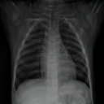

# Atlas-In-Diffusion

**A diffusion model trained only to synthesize images already contains the atlas of
its training population — recover it in one command.** Run the model's reverse
process *deterministically* (drop the noise term) and independent noise seeds
converge to the same image: the population template. No registration, no
fine-tuning, no atlas-specific objective.

From *"Atlases Are Already Inside: Recovering Population Templates from Pretrained
Diffusion Models."*

<table align="center">
  <tr>
    <td align="center"></td>
    <td align="center"></td>
    <td align="center"></td>
    <td align="center"></td>
  </tr>
  <tr>
    <td align="center">T1 brain (3D)</td>
    <td align="center">T2 brain (3D)</td>
    <td align="center">leg CT (3D)</td>
    <td align="center">chest X-ray (2D)</td>
  </tr>
</table>

## Quick start

```bash
pip install -r requirements.txt      # (install torch for your CUDA build first — see requirements.txt)
```

Recover a population atlas with one command. **3D anatomical atlases** from the
original pretrained generator (writes a NIfTI volume + a PNG preview):

```bash
python recover.py                 # T1 brain  -> outputs/t1_brain.nii.gz
python recover.py --class 4       # T2 brain  -> outputs/t2_brain.nii.gz
python recover.py --class 2       # leg CT    -> outputs/leg_ct.nii.gz
```

**2D modality atlas** from a lightweight pixel-space DDPM (writes a PNG):

```bash
python recover.py --domain chestxray     # chest X-ray -> outputs/chestxray.png
```

The 3D generator + autoencoder are 3D-MedDiffusion's weights (one-time download,
see [Weights](#weights)); the 2D checkpoints auto-download from Hugging Face.
Other base-model anatomy classes: `0` head-neck CT, `1` chest-abdomen CT,
`2` leg CT, `3` T1 brain, `4` T2 brain, `5` abdomen MR, `6` knee MR.

### Which model

The generator is selected by the flags — no separate model switch:

| command | model used |
|---|---|
| `python recover.py` | **base** generator (default) |
| `python recover.py --class 4` | **base** generator, a different anatomy class |
| `python recover.py --age 70` | **age-conditioned** generator (experimental, see below) |

Passing `--age`/`--ages` loads the age model; anything else uses the base model.

## Weights

- **3D-MedDiffusion weights** — download from the authors' Google Drive (we do not
  re-host them):
  **https://drive.google.com/drive/folders/1h1Ina5iUkjfSAyvM5rUs4n1iqg33zB-J**
  and place them in `~/.cache/atlas_in_diffusion/` (or any folder, then set
  `ATLAS_WEIGHTS_DIR`):
  - `PatchVolume4x_s2.ckpt` — the autoencoder (required for every atlas)
  - `BiFlowNet_4x.pt` — the base generator (for the default / `--class` atlases)
- **Age model** (`age_cond.pt`) — fetched automatically from our
  [HF repo](https://huggingface.co/shijianjian/Atlas-In-Diffusion) when you use `--age`.

## More (base model)

```bash
python recover.py                          # T1 brain atlas
python recover.py --class 4                # a different anatomy class
```

| flag | meaning | default |
|------|---------|---------|
| `--class` | anatomy-class token for the base model (3 = T1 brain) | 3 |
| `--out` | output directory | `outputs/` |
| `--seed` | optional seed for a fixed initial `x_T` | unset |
| `--tstar` | early-stopping time (lower = more detail) | 99 |

## Age-conditioned atlases

```bash
python recover.py --age 50                 # one age
python recover.py --ages 20,40,60          # a family
```

> **Note.** The age-conditioned generator is a proof-of-concept fine-tuned on a
> **small dataset**. Its atlases are softer, and — unlike the base model — recovery
> is **not fully stable across random initializations**. Treat these results as
> illustrative of the *conditioning* idea, not as production atlases. The paper's
> quantitative age results average several random-seed recoveries to smooth out
> this variation.

Age flags: `--age N` / `--ages a,b,c` (years), `--cfg` (age guidance scale, default 1.0).

## Other modalities — 2D

The same recovery works on lightweight **2D pixel-space DDPMs** (no autoencoder),
one small model per modality. Weights auto-download from the
[HF repo](https://huggingface.co/shijianjian/Atlas-In-Diffusion).

```bash
python recover.py --domain chestxray       # -> outputs/chestxray.png
```

The recovered chest-X-ray atlas is a coherent population template (ribs, lungs,
mediastinum). More 2D domains can be added by dropping a checkpoint on the HF repo
and extending `DOMAIN_2D_FILES` in `atlas/hf.py`.

## How it works

`recover.py` draws `x_T ~ N(0, I)` in the model's latent space, fixes the anatomy
(and optional age) conditioning, iterates the posterior-mean update
`x_{t-1} = μ_θ(x_t, t)` (no noise term) down to `t*`, and decodes through the frozen
autoencoder. Pass `--seed` for bit-reproducible output (it pins the RNG and selects
deterministic cuDNN kernels); without it, runs vary slightly at the sub-voxel level.

## Requirements

A CUDA GPU with **≥ 40 GB** memory is recommended for the 3D model. Runs on CPU but
very slowly. Tested with Python 3.11, PyTorch 2.1.2 (CUDA 11.8).

## Example atlases

`examples/` holds PNG previews; the full NIfTI volumes are on
[Hugging Face](https://huggingface.co/shijianjian/Atlas-In-Diffusion).


## Bundled model code
`atlas/_vendor/ddpm/` and `atlas/_vendor/AutoEncoder/` are a frozen copy of the
model code from **3D-MedDiffusion**
(https://github.com/ShanghaiTech-IMPACT/3D-MedDiffusion, arXiv:2412.13059), with
age-conditioning added to `BiFlowNet.py` and the deterministic recovery operator in
`trajectory.py` contributed by this work. Respect the 3D-MedDiffusion license and
retain this attribution. 3D-MedDiffusion itself builds on
[latent-diffusion](https://github.com/CompVis/latent-diffusion) and
[medicaldiffusion](https://github.com/firasgit/medicaldiffusion).
