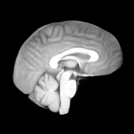
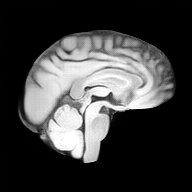
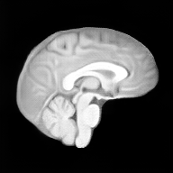
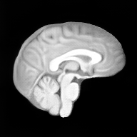
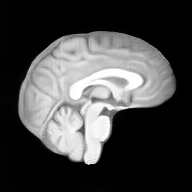

# Atlas-In-Diffusion

**A diffusion model trained only to synthesize images already contains the atlas of
its training population — recover it in one command.** Run the model's reverse
process *deterministically* (drop the noise term) and every noise seed converges to
the same image: the population template. No registration, no fine-tuning, no
atlas-specific objective.

From *"Atlases Are Already Inside: Recovering Population Templates from Pretrained
Diffusion Models."*

<table align="center">
  <tr>
    <th colspan="2">Per anatomy</th>
    <th colspan="3">Age-conditioned &mdash; one model, one atlas per age</th>
  </tr>
  <tr>
    <td align="center"></td>
    <td align="center"></td>
    <td align="center"></td>
    <td align="center"></td>
    <td align="center"></td>
  </tr>
  <tr>
    <td align="center">brain T1</td>
    <td align="center">brain T2</td>
    <td align="center">age 20</td>
    <td align="center">age 40</td>
    <td align="center">age 60</td>
  </tr>
</table>

## Quick start

```bash
pip install -r requirements.txt      # (install torch for your CUDA build first — see requirements.txt)
python recover.py                    # -> outputs/age50.nii.gz  (+ preview PNG)
```

The age-conditioned model auto-downloads from
[Hugging Face](https://huggingface.co/shijianjian/Atlas-In-Diffusion). The base
**autoencoder** (needed to decode) comes from 3D-MedDiffusion's own release — a
one-time manual download (see below).

## Weights

- **Age model** (`age_cond.pt`) — fetched automatically from our
  [HF repo](https://huggingface.co/shijianjian/Atlas-In-Diffusion).
- **3D-MedDiffusion weights** — download from the authors' Google Drive (we do not
  re-host them):
  **https://drive.google.com/drive/folders/1h1Ina5iUkjfSAyvM5rUs4n1iqg33zB-J**
  and place them in `~/.cache/atlas_in_diffusion/` (or any folder, then set
  `ATLAS_WEIGHTS_DIR`):
  - `PatchVolume4x_s2.ckpt` — the autoencoder (required for any atlas)
  - `BiFlowNet_4x.pt` — the base generator (only for `--base`)

## More

```bash
python recover.py --age 70                 # a different age
python recover.py --ages 20,40,60,80       # a whole age family
python recover.py --base                   # the original (non-age) model's brain atlas
```

| flag | meaning | default |
|------|---------|---------|
| `--age` / `--ages` | age(s) in years (age-conditioned model) | 50 |
| `--base` | use the original pretrained generator (no age) | off |
| `--out` | output directory | `outputs/` |
| `--tstar` | early-stopping time (lower = more detail) | 99 |
| `--cfg` | age guidance scale (>1) | 1.0 |

## How it works

`recover.py` draws `x_T ~ N(0, I)` in the model's latent space, fixes the anatomy
(and optional age) conditioning, iterates the posterior-mean update
`x_{t-1} = μ_θ(x_t, t)` (no noise term) down to `t*`, and decodes through the frozen
autoencoder. Recovery is deterministic by default, so runs are bit-reproducible
(set `ATLAS_NONDETERMINISTIC=1` to opt out).

## Requirements

A CUDA GPU with **≥ 40 GB** memory is recommended for the 3D model. Runs on CPU but
very slowly. Tested with Python 3.11, PyTorch 2.1.2 (CUDA 11.8).

## Example atlases

`examples/` holds PNG previews; the full NIfTI volumes are on
[Hugging Face](https://huggingface.co/shijianjian/Atlas-In-Diffusion).


## Bundled model code
`atlas/_vendor/ddpm/` and `atlas/_vendor/AutoEncoder/` are a frozen copy of the
model code from **3D-MedDiffusion**
(https://github.com/ShanghaiTech-IMPACT/3D-MedDiffusion, arXiv:2412.13059), with
age-conditioning added to `BiFlowNet.py` and the deterministic recovery operator in
`trajectory.py` contributed by this work. Respect the 3D-MedDiffusion license and
retain this attribution. 3D-MedDiffusion itself builds on
[latent-diffusion](https://github.com/CompVis/latent-diffusion) and
[medicaldiffusion](https://github.com/firasgit/medicaldiffusion).
